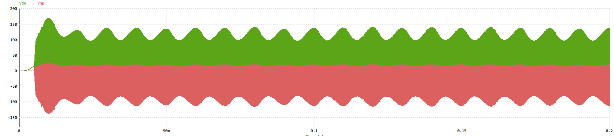

# High-Performance DC Power Supply Design Based on Flyback Topology

## Project Overview

This repository contains the design and implementation of a high-performance DC power supply based on the flyback topology. The project includes learning notes, PSIM simulation files, and JLCPCB PCB design files.

## Design Specifications

1. Input DC Voltage Range: Nominal 24VDC (18-30VDC)
2. Output DC Voltage/Current: 
   - +5V/1A
   - +15V/0.3A
3. Transformer Core: EE20
4. Output Voltage/Current Ripple: ≤ 5%

## Circuit Design
For more detial of the circuit design,please cheack the `Schematics` folder.

The power supply design incorporates the following stages:

1. AC-DC Conversion: 220V 50Hz AC is stepped down to a lower voltage.
2. EMI Filtering: Reduces electromagnetic interference.
3. Full-Bridge Rectification: Converts AC to pulsating DC.
4. Flyback Converter: Main power conversion stage.
5. Clamping and Filtering: Limits output voltages to 5V and 15V.
6. Voltage Sampling: Optically isolated voltage sampling circuit.
7. Control: Utilizes the UC3842 chip for regulation and control.

## Repository Contents

- Learning Notes
- PSIM Simulation Files
- JLCPCB PCB Design Files

## Simulation Results

### Output Voltages

In this graph:
- Vin: DC voltage input to the flyback circuit after rectification
- Vo151: Unclamped 15V output voltage
- Vo15r1: Clamped and filtered 15V output
- Vo5: Unclamped 5V output voltage
- Vo5r: Clamped and filtered 5V output

### Reverse Voltages

This graph shows:
- Vds: Reverse voltage across the MOSFET
- Vnp: voltage across the transformer

## How to Use This Repository

1. Schematic: PNG format schematic diagrams are located in the `Schematics` folder.
2. PCB: PDF outputs and BOM (Bill of Materials) are available in the `PCB` folder.
3. Simulation:
   - PSIM simulation file: `flyback.psimsch`
   - Simulation results output file: `flyback.smv`
4. PCB Design: JLCPCB PCB design file is named `Flyback_circuit_2024-07-31.epro`

## Getting Started

[Include instructions on how to use the files, run simulations, or fabricate the PCB]

## Contributing

[Explain how others can contribute to your project]

## License

[Specify the license under which you're releasing this project]

